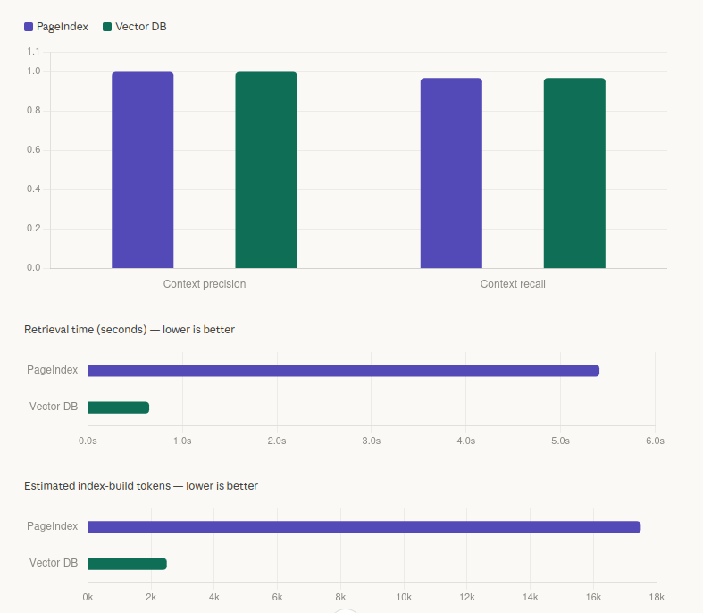

# RAG Evaluation: PageIndex vs Vector DB

A head-to-head evaluation of two retrieval strategies for RAG (Retrieval-Augmented Generation) on a structured legal document — the **Constitution of India (50 pages)**.

---

## Experiment overview



Two RAG pipelines were built and evaluated end-to-end using the same document, the same 15 questions, the same ground truth answers, and the same LLM — making the comparison a direct apples-to-apples measurement.

---

## Pipelines

### PageIndex (tree-based retrieval)
1. Extract table of contents from PDF
2. Build a hierarchical node tree (chapters → sections → subsections)
3. Generate GPT summaries for each node
4. At query time: LLM reasons over the tree to identify relevant nodes
5. Retrieve full text of matched nodes → generate answer

### Vector DB (FAISS + embeddings)
1. Extract text from PDF page by page (PyPDF2)
2. Split into 500-token overlapping chunks
3. Embed all chunks using `text-embedding-3-small`
4. Build FAISS flat inner product index
5. At query time: embed query → cosine search → retrieve top-K chunks → generate answer

---

## Setup

| Component | Value |
|---|---|
| Document | Constitution of India (50 pages) |
| Questions | 15 hand-crafted Q&A pairs with ground truth |
| LLM | GPT-4o-mini |
| Embeddings | text-embedding-3-small |
| Vector store | FAISS (flat inner product) |
| Chunk size | 500 tokens, 50-token overlap |
| Top-K retrieval | 3 chunks |
| Evaluation framework | RAGAS |

---

## Results



### Quality metrics

| Metric | PageIndex | Vector DB |
|---|---|---|
| Context precision | 1.00 | 1.00 |
| Context recall | 0.97 | 0.97 |
| Faithfulness | 0.83 | 1.00 |

### Speed & cost

| Metric | PageIndex | Vector DB |
|---|---|---|
| Avg retrieval time | 5.41s | 0.65s |
| Index-build tokens (est.) | ~17,500 | ~2,500 |
| LLM calls during indexing | Yes (summarisation) | No |

---

## Key observations

- Both pipelines scored **identically** on context precision (1.00) and context recall (0.97)
- Vector DB scored **higher on faithfulness**: 1.00 vs 0.83
- Vector DB is **8.3x faster** at retrieval: 0.65s vs 5.41s
- Vector DB used **7x fewer tokens** at index-build time: ~2,500 vs ~17,500
- PageIndex requires LLM calls during indexing — Vector DB does not
- PageIndex uses LLM reasoning to navigate the document tree — Vector DB uses approximate semantic similarity

---

## Evaluation metrics (RAGAS)

| Metric | What it measures |
|---|---|
| **Faithfulness** | Are the answers grounded in the retrieved context? |
| **Answer relevancy** | Is the answer on-topic with the question? |
| **Context precision** | Is the retrieved context relevant to the question? |
| **Context recall** | Does the retrieved context contain all necessary evidence? |

---

## File structure

```
.
├── pageindex/
│   ├── page_index.py          # Core PageIndex pipeline
│   ├── page_index_md.py       # Markdown-based tree builder
│   ├── utils.py               # Shared utilities
│   └── config.yaml            # Configuration
├── evaluate_pageindex.py      # RAGAS evaluation for PageIndex
├── evaluate_vectordb.py       # RAGAS evaluation for Vector DB
├── query_pageindex.py         # Single-question query script
├── questions.csv              # 15 Q&A pairs with ground truth
├── run_pageindex.py           # PDF indexing entry point
└── results/
    └── data_page_structure.json   # Generated PageIndex JSON
```

---

## Usage

### Build PageIndex from PDF
```bash
python3 run_pageindex.py --pdf_path your_document.pdf
```

### Query PageIndex
```bash
python3 query_pageindex.py \
  --question "What does Article 21 state?" \
  --json results/your_doc_structure.json \
  --key sk-xxxx \
  --model gpt-4o-mini
```

### Run RAGAS evaluation — PageIndex
```bash
python3 evaluate_pageindex.py \
  --csv questions.csv \
  --json results/your_doc_structure.json \
  --key sk-xxxx \
  --model gpt-4o-mini \
  --output pageindex_report.csv
```

### Run RAGAS evaluation — Vector DB
```bash
python3 evaluate_vectordb.py \
  --pdf your_document.pdf \
  --csv questions.csv \
  --key sk-xxxx \
  --model gpt-4o-mini \
  --output vectordb_report.csv
```

---

## Config (PageIndex)

```yaml
model: "gpt-4o-mini"
toc_check_page_num: 3
max_page_num_each_node: 5
max_token_num_each_node: 10000
if_add_node_id: "yes"
if_add_node_summary: "yes"
if_add_doc_description: "no"
if_add_node_text: "yes"
```

---

## Requirements

```bash
pip install openai ragas datasets pandas faiss-cpu pypdf2 tiktoken langchain-openai
```

---

## CSV format for evaluation

```csv
question,ground_truth
"What does Article 21 state?","Article 21 states that no person shall be deprived of their life or personal liberty except according to procedure established by law."
"What does Article 14 guarantee?","Article 14 guarantees equality before the law and equal protection of laws."
```
